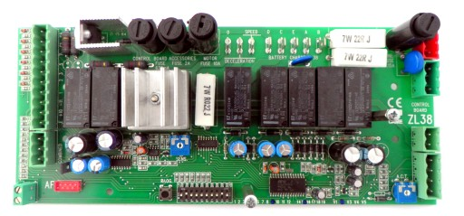
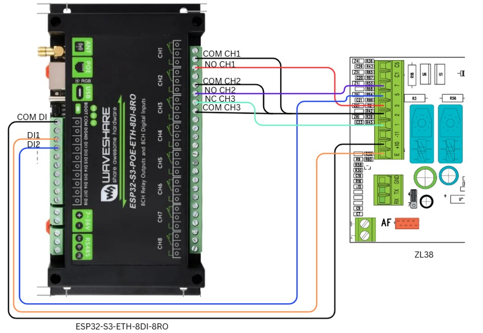
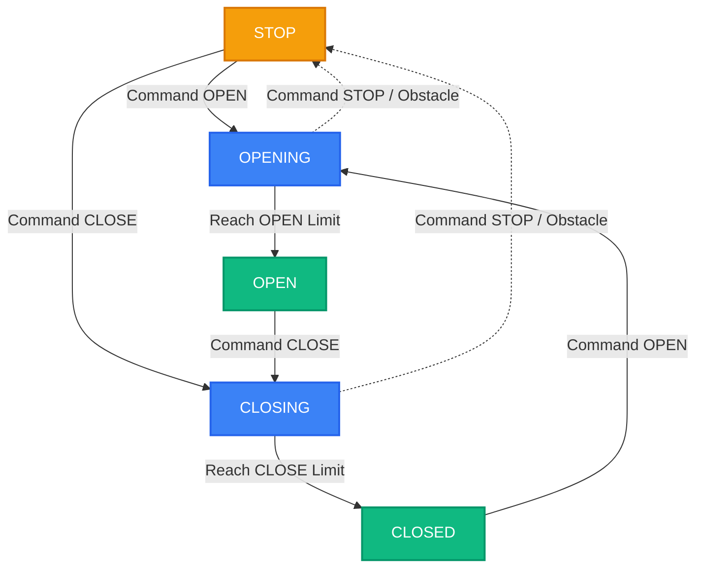
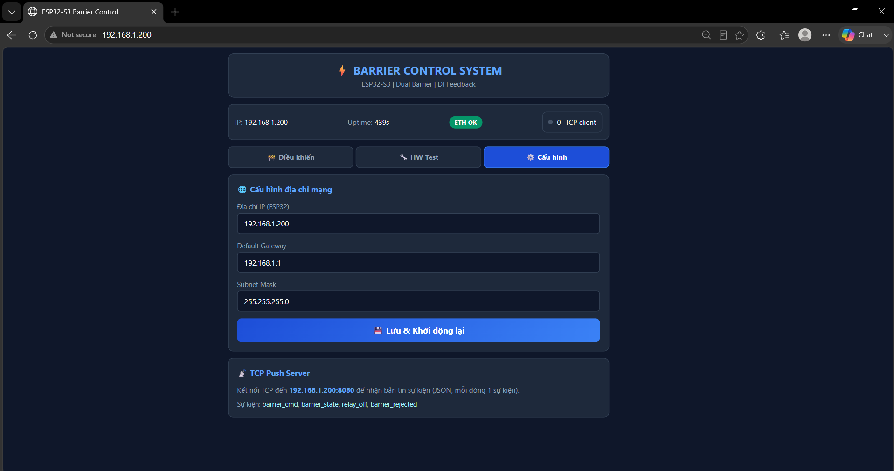

# BÁO CÁO TỔNG QUAN DỰ ÁN HỆ THỐNG ĐIỀU KHIỂN BARRIER TRUNG TÂM
**Người thực hiện:** [Trần Quang Anh, Trần Văn Ninh, Trần Quang Hiếu]
**Nền tảng phần cứng:** ESP32-S3 PoE ETH (8DI - 8RO) & Board CAME ZL38

---

## I. GIỚI THIỆU DỰ ÁN
Dự án nhằm mục đích thiết kế và xây dựng một **Hệ thống điều khiển Barrier (Dual-Barrier Control System)**. Hệ thống đóng vai trò làm cầu nối giữa phần mềm quản lý bãi xe trung tâm và phần cứng cơ điện của cổng Barrier. 

Hệ thống hỗ trợ quá trình điều khiển tự động và giám sát trạng thái vật lý của 2 làn Barrier độc lập, hướng tới nâng cao tính ổn định khi hoạt động trong môi trường bãi xe.

---

## II. KIẾN TRÚC PHẦN CỨNG (HARDWARE ARCHITECTURE)
Hệ thống sử dụng bo mạch lõi **Waveshare ESP32-S3 PoE ETH (8 Kênh Đầu Vào Số - 8 Kênh Rơ-le)** để kết nối với bo mạch **CAME ZL38** của Barrier. Cấu hình phần cứng được chia làm 2 làn độc lập:

  
  
   
  <i>Hình 1 & 2: Board Waveshare ESP32-S3-ETH-8DI-8RO (trái) và Mạch Barrier CAME ZL38 (phải)</i>

### 1. Barrier 1
- **Điều khiển (Relay Output - RO):** 
  - `CH1`: Điều khiển lệnh MỞ (Nối vào chân `2-3` của ZL38).
  - `CH2`: Điều khiển lệnh ĐÓNG (Nối vào chân `2-7` của ZL38).
  - `CH3`: Điều khiển lệnh DỪNG (Nối vào chân STOP của ZL38).
- **Phản hồi (Digital Input - DI):**
  - `DI2`: Giám sát trạng thái **Đã mở hoàn toàn** (Nối vào chân `5` của ZL38).
  - `DI1`: Giám sát trạng thái **Đang nâng/hạ** hoặc **Đã đóng hoàn toàn** (Nối vào chân `E` của ZL38).

  
   
  <i>Hình 3: Sơ đồ kết nối tín hiệu Điều khiển và Phản hồi dành cho 1 Barrier</i>

### 2. Barrier 2
- **Điều khiển (Relay Output - RO):** `CH4` (Mở), `CH5` (Đóng), `CH6` (Dừng).
- **Phản hồi (Digital Input - DI):** `DI4` (Đã mở hoàn toàn), `DI3` (Đang nâng/hạ hoặc Đã đóng).

*(Tất cả các ngõ vào DI được cấu hình kéo điện áp `PULLDOWN` bên trong vi điều khiển nhằm giảm thiểu nguy cơ nhiễu khi tín hiệu thả nổi).*

---

## III. KIẾN TRÚC PHẦN MỀM (SOFTWARE ARCHITECTURE)
Phần mềm Firmware được lập trình bằng C/C++ trên nền tảng ESP32 Arduino Core, áp dụng kiến trúc Non-blocking để xử lý song song các tác vụ, nhằm hạn chế tình trạng bỏ sót tín hiệu trong quá trình vận hành. 

### 1. Máy trạng thái
Mỗi Barrier sở hữu một State Machine riêng biệt nhằm phân tích tín hiệu điện (0/1) từ chân DI và quy đổi ra trạng thái cổng vật lý (Physical State):
- `OPEN` (Mở hoàn toàn): Xảy ra khi chân Fully-Open (DI2/DI4) kích hoạt.
- `OPENING` / `CLOSING` (Đang nâng hạ): Xảy ra khi chân Moving (DI1/DI3) có tín hiệu nhấp nháy chuyển mức (Toggle) liên tục trong khoảng thời gian dưới 2 giây.
- `CLOSED` (Đóng hoàn toàn): Khi tín hiệu ngừng nhấp nháy quá 2 giây và duy trì ở mức điện áp CAO.
- `STOPPED` (Dừng lửng/Kẹt): Khi tín hiệu ngừng nhấp nháy quá 2 giây và rớt về mức điện áp THẤP.

<i>Sơ đồ 1: Luồng chuyển đổi trạng thái (State Machine) của Barrier</i>

### 2. Giao thức Mạng (Network & API)
Hệ thống sử dụng mạng LAN (Cổng RJ45 kết nối qua chip W5500) để giúp duy trì kết nối mạng thường xuyên.
- **RESTful API (Port 80):** Cung cấp các Endpoint chuẩn hóa (`/api/barrier?id=X&action=Y`) để phần mềm cấp trên có thể gọi lệnh (Open/Close/Stop) bằng JSON.
- **TCP Push Server (Port 8080):** Kênh giao tiếp thời gian thực. Bất cứ khi nào Barrier có chuyển động hoặc nhận lệnh, thiết bị sẽ tự động xuất bản tin sự kiện (`barrier_state`, `barrier_cmd`) lên phần mềm đang kết nối.

### 3. Giao diện quản lý nội bộ (Web UI)
Được tích hợp thẳng vào bộ nhớ ROM của vi điều khiển, người dùng chỉ cần gõ IP của thiết bị vào trình duyệt để truy cập:
- Phản hồi tức thời trên máy tính.
- Cho phép giám sát trạng thái trực tiếp của 2 Barrier.
- Tích hợp tính năng an toàn (Fail-safe): Hỗ trợ vô hiệu hóa nút bấm điều khiển tương ứng khi cổng đã mở/đóng, và ngắt thao tác khi phát hiện mất mạng.
- Tích hợp công cụ chẩn đoán phần cứng: Quét địa chỉ I2C, Test từng kênh Relay đơn lẻ, Cấu hình lại IP tĩnh hệ thống.

  
   
  <i>Hình 4: Giao diện Web UI giám sát và điều khiển Barrier</i>

---

## IV. TỔNG KẾT
Hệ thống đã cơ bản hoàn thiện các chức năng đề ra từ phần cứng tới phần mềm. Các giải pháp đang được áp dụng mang đến một số ưu điểm như:
- **Tăng cường độ tin cậy:** Thông qua cấu hình phần cứng và tính năng an toàn (Fail-safe) trong phần mềm, hệ thống có khả năng tự động xử lý và bảo vệ mạch phần nào trong các tình huống nhiễu tín hiệu hoặc rớt mạng.
- **Khả năng giám sát trạng thái:** Việc tích hợp đọc tín hiệu DI (Feedback) giúp phần mềm quản lý trung tâm có thêm cơ sở dữ liệu về trạng thái thực tế của cổng, giảm thiểu rủi ro so với việc chỉ ra lệnh điều khiển một chiều.
- **Khả năng tương thích:** Hệ thống cung cấp các API tiêu chuẩn và luồng dữ liệu TCP Push, tạo điều kiện thuận lợi hơn cho quá trình ghép nối với đa dạng các phần mềm quản lý bãi xe hiện hành.
