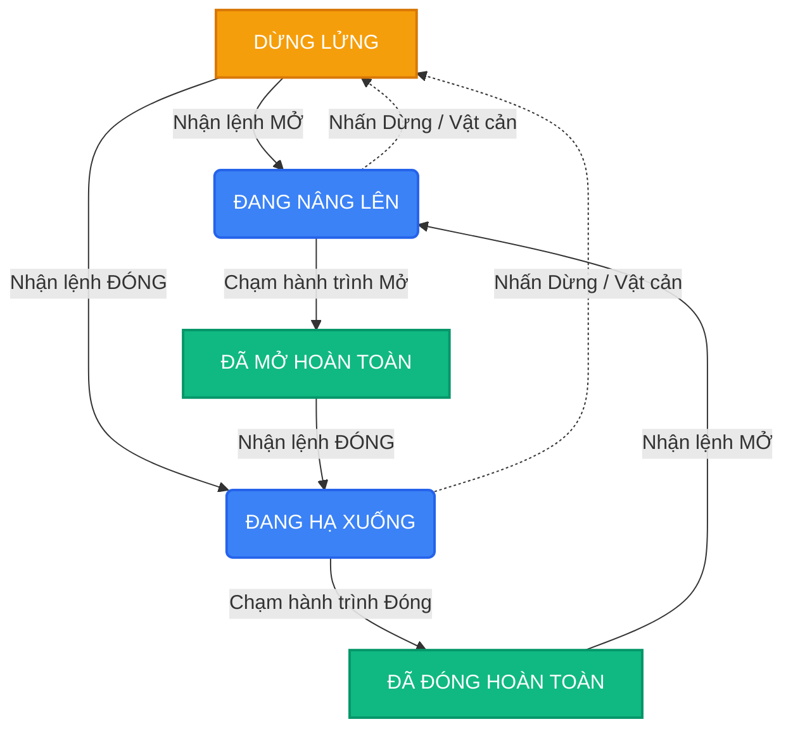

# BÁO CÁO TỔNG QUAN DỰ ÁN HỆ THỐNG ĐIỀU KHIỂN BARRIER TRUNG TÂM
**Người thực hiện:** [Trần Quang Anh, Trần Văn Ninh, Trần Quang Hiếu]
**Nền tảng phần cứng:** ESP32-S3 PoE ETH (8DI - 8RO) & Board CAME ZL38

---

## I. GIỚI THIỆU DỰ ÁN
Dự án nhằm mục đích thiết kế và xây dựng một **Hệ thống điều khiển Barrier thông minh (Dual-Barrier Control System)**. Hệ thống đóng vai trò làm cầu nối giữa phần mềm quản lý bãi xe trung tâm và phần cứng cơ điện của cổng Barrier. 

Hệ thống cho phép điều khiển tự động, giám sát trạng thái vật lý của 2 làn Barrier độc lập theo thời gian thực với độ tin cậy và tính ổn định cao trong môi trường công nghiệp.

---

## II. KIẾN TRÚC PHẦN CỨNG (HARDWARE ARCHITECTURE)
Hệ thống sử dụng bo mạch lõi **Waveshare ESP32-S3 PoE ETH (8 Kênh Đầu Vào Số - 8 Kênh Rơ-le)** để kết nối với bo mạch **CAME ZL38** của Barrier. Cấu hình phần cứng được chia làm 2 làn độc lập:

  
  
   
  <i>Hình 1 & 2: Board Waveshare ESP32-S3-ETH-8DI-8RO (trái) và Mạch Barrier CAME ZL38 (phải)</i>

### 1. Barrier 1
- **Điều khiển (Relay Output - RO):** 
  - `CH1`: Điều khiển lệnh MỞ (Nối vào chân `2-3` của ZL38).
  - `CH2`: Điều khiển lệnh ĐÓNG (Nối vào chân `2-7` của ZL38).
  - `CH3`: Điều khiển lệnh DỪNG (Nối vào chân STOP của ZL38).
- **Phản hồi (Digital Input - DI):**
  - `DI2`: Giám sát trạng thái **Đã mở hoàn toàn** (Nối vào chân `5` của ZL38).
  - `DI1`: Giám sát trạng thái **Đang nâng/hạ** hoặc **Đã đóng hoàn toàn** (Nối vào chân `E` của ZL38).

  
   
  <i>Hình 3: Sơ đồ kết nối tín hiệu Điều khiển và Phản hồi dành cho 1 Barrier</i>

### 2. Barrier 2
- **Điều khiển (Relay Output - RO):** `CH4` (Mở), `CH5` (Đóng), `CH6` (Dừng).
- **Phản hồi (Digital Input - DI):** `DI4` (Đã mở hoàn toàn), `DI3` (Đang nâng/hạ hoặc Đã đóng).

*(Tất cả các ngõ vào DI được cấu hình kéo điện áp `PULLDOWN` bên trong vi điều khiển nhằm cách ly nhiễu hoàn toàn khi tín hiệu thả nổi).*

---

## III. KIẾN TRÚC PHẦN MỀM (SOFTWARE ARCHITECTURE)
Phần mềm Firmware được lập trình bằng C/C++ trên nền tảng ESP32 Arduino Core, áp dụng kiến trúc Non-blocking để xử lý song song các tác vụ mà không làm gián đoạn lẫn nhau, đảm bảo không bỏ sót bất kỳ tín hiệu nào. 

### 1. Máy trạng thái
Mỗi Barrier sở hữu một State Machine riêng biệt nhằm phân tích tín hiệu điện (0/1) từ chân DI và quy đổi ra trạng thái cổng vật lý (Physical State):
- `OPEN` (Mở hoàn toàn): Xảy ra khi chân Fully-Open (DI2/DI4) kích hoạt.
- `OPENING` / `CLOSING` (Đang nâng hạ): Xảy ra khi chân Moving (DI1/DI3) có tín hiệu nhấp nháy chuyển mức (Toggle) liên tục trong khoảng thời gian dưới 2 giây.
- `CLOSED` (Đóng hoàn toàn): Khi tín hiệu ngừng nhấp nháy quá 2 giây và duy trì ở mức điện áp CAO.
- `STOPPED` (Dừng lửng/Kẹt): Khi tín hiệu ngừng nhấp nháy quá 2 giây và rớt về mức điện áp THẤP.

<i>Sơ đồ 1: Luồng chuyển đổi trạng thái (State Machine) của Barrier</i>

### 2. Giao thức Mạng (Network & API)
Hệ thống sử dụng mạng LAN (Cổng RJ45 kết nối qua chip W5500) đảm bảo tính ổn định.
- **RESTful API (Port 80):** Cung cấp các Endpoint chuẩn hóa (`/api/barrier?id=X&action=Y`) để phần mềm cấp trên có thể gọi lệnh (Open/Close/Stop) bằng JSON.
- **TCP Push Server (Port 8080):** Kênh giao tiếp thời gian thực. Bất cứ khi nào Barrier có chuyển động hoặc nhận lệnh, thiết bị sẽ tự động xuất bản tin sự kiện (`barrier_state`, `barrier_cmd`) lên phần mềm đang kết nối.

### 3. Giao diện quản lý nội bộ (Web UI)
Được tích hợp thẳng vào bộ nhớ ROM của vi điều khiển, người dùng chỉ cần gõ IP của thiết bị vào trình duyệt để truy cập:
- Phản hồi tức thời trên máy tính.
- Cho phép giám sát trạng thái trực tiếp của 2 Barrier.
- Tích hợp tính năng an toàn: Tự động vô hiệu hóa nút MỞ khi cổng đang mở, khóa mọi thao tác khi mất mạng.
- Tích hợp công cụ chẩn đoán phần cứng: Quét địa chỉ I2C, Test từng kênh Relay đơn lẻ, Cấu hình lại IP tĩnh hệ thống.

---

## IV. TỔNG KẾT VÀ ỨNG DỤNG THỰC TIỄN
Hệ thống đã được thiết kế và xây dựng hoàn chỉnh từ phần cứng tới phần mềm. Giải pháp này mang lại những ưu điểm vượt trội:
- **Tiết kiệm phần cứng:** Một bộ vi điều khiển gánh được 2 cổng Barrier cùng lúc, giảm chi phí triển khai tại các bãi xe có làn vào/ra song song.
- **Tính chính xác:** Không chỉ gửi lệnh "mù", hệ thống theo dõi và báo cáo chính xác cổng có thực sự được mở/đóng hay không nhờ tích hợp DI Feedback.
- **Dễ dàng tích hợp:** API chuẩn hóa và TCP Push Server giúp mọi phần mềm quản lý bãi xe (viết bằng C#, Python, Java...) đều có thể cắm vào và điều khiển được ngay lập tức.
