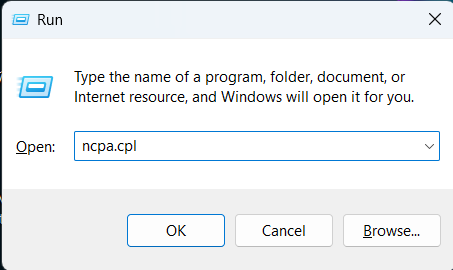
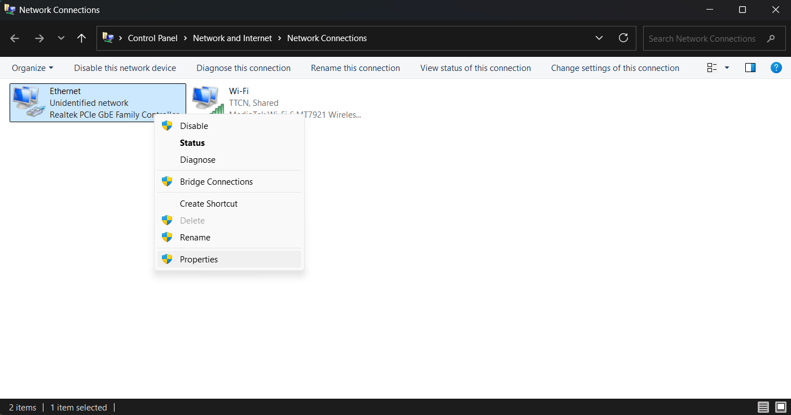
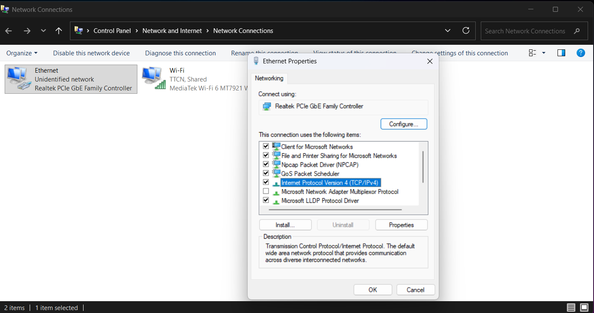
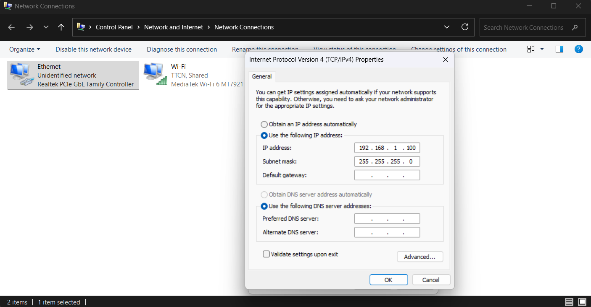
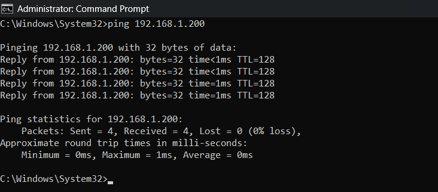
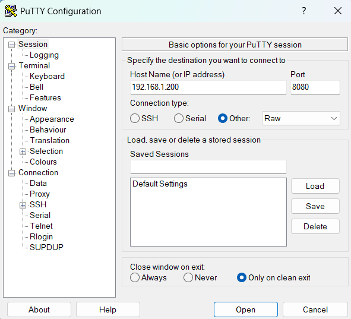
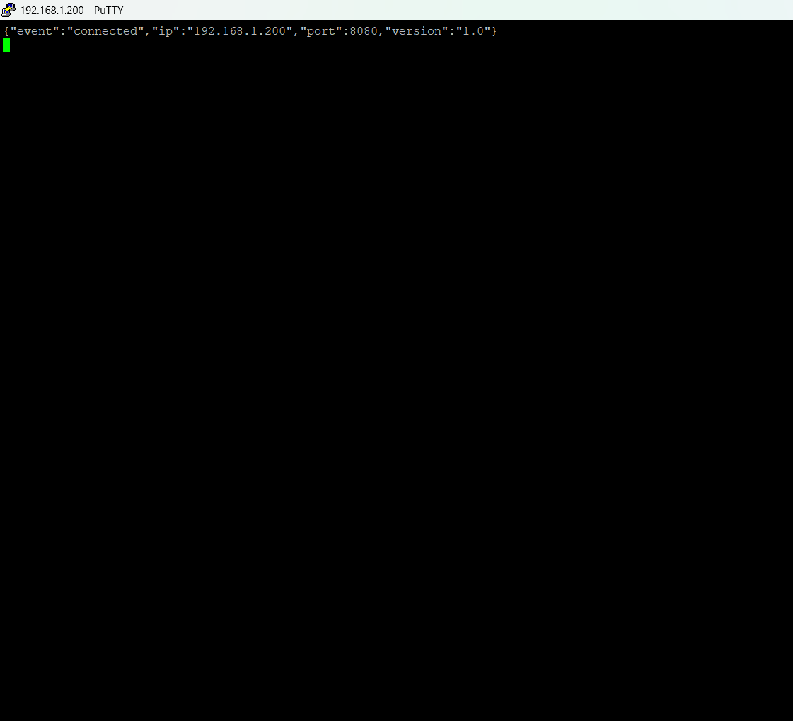

# TÀI LIỆU BÀN GIAO VÀ HƯỚNG DẪN SỬ DỤNG HỆ THỐNG ĐIỀU KHIỂN BARRIER (ESP32-S3)
 
> **Nền tảng:**  Board ESP32-S3-ETH-8DI-8RO (Vi điều khiển ESP32-S3 + Ethernet W5500 + TCA9554 8-Relay Outputs + 8-Digital Inputs)
> **Đối tượng sử dụng:** Kỹ thuật viên vận hành, Quản trị viên bãi xe và Nhà phát triển phần mềm tích hợp (Camera AI, Phần mềm bãi xe).

---

## 1. TỔNG QUAN HỆ THỐNG

Hệ thống điều khiển Barrier trung tâm sử dụng board ESP32-S3-ETH-8DI-8RO.
```
┌─────────────────┐     Cáp LAN Ethernet     ┌──────────────────────────────────────────────────────┐
│ PC / Laptop     │◄────────────────────────►│                 ESP32-S3 Board                       │
│ (192.168.1.100) │                          │  Web Server (Port 80)  |  TCP Push Server (Port 8080)│
└─────────────────┘                          └──────────────────────────────────────────────────────┘
```

### Phương thức tương tác chính:
1. **Giao diện Web UI 3 Tab (Port 80):** Giúp kỹ thuật viên/người vận hành điều khiển, kiểm tra phần cứng và cấu hình thiết bị trực tiếp trên trình duyệt Web (Chrome, Edge, Firefox) từ PC hoặc điện thoại.
2. **HTTP RESTful API (Port 80):** Cung cấp các Endpoint chuẩn JSON cho phần mềm bãi xe (C#, Python, Java) chủ động phát lệnh điều khiển và truy vấn trạng thái.
3. **TCP Socket Push Server (Port 8080):** Duy trì kết nối realtime 24/7, tự động đẩy (Push) các sự kiện thay đổi trạng thái barrier/relay về phần mềm trung tâm lập tức mà không cần tốn tài nguyên gọi API liên tục.

---

## 2. HƯỚNG DẪN KẾT NỐI PHẦN CỨNG & ĐƯA MÁY TÍNH VỀ CÙNG DẢI IP

### 2.1. Cấu hình IP Mặc định của Thiết bị
- **Địa chỉ IP mặc định:** `192.168.1.200`
- **Default Gateway:** `192.168.1.1`
- **Subnet Mask:** `255.255.255.0`
- **Cổng Web UI:** `80` (Truy cập: `http://192.168.1.200`)
- **Cổng TCP Push:** `8080`

### 2.2. Giải thích cơ chế Địa chỉ IP trong Mạng LAN
Để Máy tính và ESP32 có thể giao tiếp được với nhau qua cáp LAN:
- **Địa chỉ IP Máy tính (VD: `192.168.1.100`):** Địa chỉ duy nhất của card mạng máy tính.
- **Địa chỉ IP ESP32 (`192.168.1.200`):** Địa chỉ duy nhất của bo mạch điều khiển.
- **Quy tắc kết nối:** Hai thiết bị phải có địa chỉ **CÙNG DẢI MẠNG** (cùng 3 số đầu `192.168.1.x`) nhưng **KHÁC SỐ CUỐI** để tránh trùng lặp IP.

### 2.3. Hướng dẫn Đặt IP Tĩnh cho Máy tính trên Windows (10 / 11)

Khi cắm cáp LAN trực tiếp từ máy tính vào ESP32 (không qua Router có DHCP), bạn cần cài IP tĩnh cho máy tính theo các bước chi tiết sau:

**Bước 1:** Nhấn tổ hợp phím **`Win + R`** ➔ Nhập **`ncpa.cpl`** ➔ Nhấn **Enter** để mở cửa sổ *Network Connections*.
<p align="center">
  
</p>

**Bước 2:** Chuột phải vào biểu tượng card mạng **Ethernet** ➔ Chọn **Properties**.
<p align="center">
  
</p>

**Bước 3:** Cửa sổ mở ra, chọn **Internet Protocol Version 4 (TCP/IPv4)** ➔ Nhấn nút **Properties**.
<p align="center">
  
</p>

**Bước 4:** Tích chọn **Use the following IP address** và nhập các thông số:
- **IP address:** `192.168.1.100` *(hoặc số bất kỳ từ 2 đến 254, ngoại trừ 200)*
- **Subnet mask:** `255.255.255.0`
- **Default gateway:** `192.168.1.1` *(hoặc để trống)*
<p align="center">
  
</p>

**Bước 5:** Nhấn **OK** ➔ Nhấn **Close** để lưu cấu hình.

**Bước 6:** Kiểm tra kết nối mạng bằng **Command Prompt (CMD)**:
- Mở CMD ➔ Gõ lệnh: `ping 192.168.1.200`
- Nếu màn hình trả về `Reply from 192.168.1.200: bytes=32 time<1ms` ➔ **Đã kết nối thành công!**
<p align="center">
  
</p>

**Bước 7:** Mở trình duyệt Web (Chrome/Edge/Firefox) ➔ Gõ địa chỉ: **`http://192.168.1.200`** để truy cập giao diện điều khiển.

---

## 2. BẢNG LOGIC VẬN HÀNH & NHẬN DIỆN TRẠNG THÁI BARRIER

Hệ thống ESP32 đọc tín hiệu phản hồi từ các chân ngõ vào số (DI) kết nối với mạch CAME ZL38 (chân 5 và chân E) để xác định trạng thái vận hành của Barrier theo bảng logic quy chuẩn sau:

### 2.1. Bảng Logic Nhận Diện Trạng Thái (`barrier_state`)

| DI2 (Phản hồi Mở) | DI1 (Phản hồi Chạy/Đóng) | Thời gian & Trạng thái tín hiệu DI1 | Trạng thái hệ thống (`barrier_state`) | Mô tả hành vi vận hành thực tế |
|:---:|:---:|:---:|:---:|---|
| **`1`** | *(Không quan tâm)* | *(Bất kỳ)* | **`OPEN`** *(Mở hoàn toàn)* | Cần Barrier đã nâng hết cỡ lên đỉnh. Cảm biến ngắt hành trình báo mở. |
| **`0`** | `0/1` | Đảo trạng thái nhấp nháy liên tục `< 2s` | **`OPENING` / `CLOSING`** *(Đang nâng / Đang hạ)* | Motor đang quay di chuyển cần barrier (hướng nâng/hạ xác định theo lệnh vừa phát). |
| **`0`** | **`1`** | Giữ nguyên mức `1` liên tục `≥ 2s` (không đảo) | **`CLOSED`** *(Đóng hoàn toàn)* | Cần Barrier đã hạ xuống hết cỡ chạm đất. Tín hiệu giữ nguyên liên tục `1`. |
| **`0`** | **`0`** | Giữ nguyên mức `0` liên tục `≥ 2s` (không đảo) | **`STOPPED`** *(Dừng ở vị trí lửng)* | Barrier bị dừng giữa chừng (do bấm nút STOP khẩn cấp hoặc gặp vật cản/cảm biến an toàn). |

> 📌 **Ghi chú kỹ thuật về mức logic tín hiệu:**  
> - **Mức `1` (Active):** Có điện áp `+24V` xuất từ ZL38 vào chân DI của ESP32 (Optocoupler cách ly dẫn ➔ GPIO reading = `LOW`).  
> - **Mức `0` (Inactive):** Không có điện áp `0V` / thả nổi (Optocoupler ngắt ➔ GPIO reading = `HIGH`).

---

## 3. HƯỚNG DẪN SỬ DỤNG GIAO DIỆN WEB UI (3 TAB)


### 3.1. Tab 1: 🚧 Điều khiển Barrier (Barrier Control)

Tab chuyên dụng cho thao tác vận hành hàng ngày:

<p align="center">
  <br>
  <em>Hình 1: Tab điều khiển chính.</em>
</p>

- **Bảng thông tin Barrier 1 & Barrier 2:**
  - **Nhãn trạng thái (State Badge):** Hiển thị trạng thái tức thì theo màu sắc:
    - <span style="color:#94a3b8;font-weight:bold">IDLE / UNKNOWN</span>: Rảnh, sẵn sàng nhận lệnh.
    - <span style="color:#6ee7b7;font-weight:bold">OPENING / OPEN</span>: Barrier đang mở hoặc đã mở hoàn toàn.
    - <span style="color:#fca5a5;font-weight:bold">CLOSING / CLOSED</span>: Barrier đang đóng hoặc đã đóng hoàn toàn.
    - <span style="color:#fde68a;font-weight:bold">STOPPING / STOPPED</span>: Barrier đã dừng ngắt khẩn cấp.
- **3 Nút lệnh điều khiển:**
  - **🔓 MỞ (OPEN):** Kích rơ-le Mở (CH1 / CH4).
  - **✋ DỪNG (STOP):** Kích rơ-le Dừng khẩn cấp (CH2 / CH5), ngắt ngay lập tức lệnh Mở/Đóng.
  - **🔒 ĐÓNG (CLOSE):** Kích rơ-le Đóng (CH3 / CH6).
- **Cơ chế Khóa UI thông minh:**
  - Để tránh người dùng bấm nhầm hoặc spam nút, khi Barrier ở trạng thái nào thì nút tương ứng sẽ tự động bị mờ và khóa cấm bấm (`disabled`).
  - **Cảnh báo đứt mạng:** Nếu dây mạng bị rút hoặc đứt kết nối, một Banner đỏ rực sẽ hiện lên: `⚠️ MẤT KẾT NỐI MẠNG — ĐÃ KHÓA TOÀN BỘ THAO TÁC`, đảm bảo an toàn tuyệt đối.
- **Khung Nhật ký (Log Box):** Hiển thị chi tiết 40 sự kiện gần nhất (Thời gian, tên lệnh, phản hồi thành công/thất bại).

### 3.2. Tab 2: 🔧 Kiểm tra Phần cứng (Hardware Test)

Tab dành cho kỹ thuật viên kiểm tra độc lập các rơ-le và đường truyền I2C:

<p align="center">
  <br>
  <em>Hình 2: Tab kiểm tra phần cứng.</em>
</p>

1. **Chẩn đoán I2C Bus (`▶ Bắt đầu quét`):**
   - Tự động quét và phát hiện chip mở rộng I/O **TCA9554** tại địa chỉ `0x20` (hoặc các chân SDA/SCL trên bo mạch).
2. **Kiểm tra 8 Kênh Relay độc lập (CH1 ➔ CH8):**
   - **XUNG (Pulse):** Kích relay bật trong thời gian cài đặt (từ 100ms ➔ 2000ms) rồi tự động tắt.
   - **BẬT (ON):** Bật cố định rơ-le.
   - **TẮT (OFF):** Tắt rơ-le.
   - Đèn LED màu xanh chỉ thị trạng thái thực tế của từng rơ-le theo thời gian thực.

### 3.3. Tab 3: ⚙️ Cấu hình Mạng & Hệ thống (Network Config)

Tab cho phép thay đổi thông số mạng tĩnh và lưu cố định vào bộ nhớ NVS (không bị mất khi tắt điện):

<p align="center">
  <br>
  <em>Hình 3: Tab cấu hình địa chỉ IP.</em>
</p>

1. **Thay đổi Địa chỉ IP tĩnh:**
   - **Địa chỉ IP (ESP32):** Nhập IP mới (Ví dụ: `192.168.1.150` hoặc `10.0.0.200`).
   - **Default Gateway:** Nhập Gateway tương ứng (Ví dụ: `192.168.1.1` hoặc `10.0.0.1`).
   - **Subnet Mask:** Nhập Subnet (Mặc định `255.255.255.0`).
2. **Quy trình Lưu & Tự động Khởi động lại:**
   - Bấm nút **`💾 Lưu & Khởi động lại`**.
   - ESP32 lưu thông số vào NVS và khởi động lại sau 500ms.
   - Trang Web tự động hiện hộp thoại đếm ngược **5 giây** và chuyển hướng trình duyệt sang địa chỉ IP mới.
3. **Giám sát TCP Push Server (Port 8080):**
   - Hiển thị địa chỉ TCP Socket (`<IP_ESP32>:8080`) và số lượng Client (Phần mềm bãi xe) đang kết nối trực tiếp.

---

## 4. TÀI LIỆU TÍCH HỢP REST API (DÀNH CHO LẬP TRÌNH VIÊN)

Dành cho nhà phát triển phần mềm bãi xe / Camera AI gửi lệnh điều khiển bằng HTTP GET.
*(Ví dụ IP thiết bị: `192.168.1.200`)*

### 4.1. Điều khiển Barrier (State Machine & Interlock)
*   **Endpoint:** `GET /api/barrier`
*   **Tham số (Query Parameters):**
    *   `id` *(Tùy chọn)*: ID Barrier (`1` hoặc `2`, mặc định `1`).
    *   `action` *(Bắt buộc)*: `open` | `stop` | `close`
    *   `duration` *(Tùy chọn)*: Thời gian xung (ms), mặc định `400`.

**Ví dụ 1: Mở Barrier 1**  
`GET http://192.168.1.200/api/barrier?id=1&action=open`

**Phản hồi thành công (JSON):**
```json
{
  "result": "ok",
  "barrier": 1,
  "action": "open",
  "duration_ms": 400,
  "current_state": "OPENING"
}
```

**Phản hồi khi DỪNG ngắt khẩn cấp:**
```json
{
  "result": "preempted",
  "barrier": 1,
  "action": "stop",
  "duration_ms": 400,
  "current_state": "STOPPING"
}
```

**Phản hồi khi bận (Barrier đang chạy):**
```json
{
  "result": "busy",
  "barrier": 1,
  "action": "close",
  "duration_ms": 400,
  "current_state": "OPENING"
}
```

### 4.2. Kiểm tra Trạng thái Toàn hệ thống
*   **Endpoint:** `GET /api/status`

**Phản hồi mẫu (JSON):**
```json
{
  "status": "online",
  "ip": "10.2.22.12",
  "gateway": "10.2.22.1",
  "subnet": "255.255.255.0",
  "uptime_s": 3600,
  "eth_link": true,
  "tcp_clients": 1,
  "relays_byte": 0,
  "relays": {
    "CH1": false, "CH2": false, "CH3": false, "CH4": false,
    "CH5": false, "CH6": false, "CH7": false, "CH8": false
  },
  "di1": 0,
  "di2": 1,
  "barrier_1_state": "OPEN",
  "barrier_2_state": "CLOSED"
}
```

### 4.3. Điều khiển Kênh Relay Thô (Raw Relay Control)
*   **Endpoint:** `GET /api/relay`
*   **Tham số:** `ch` (`1`–`8` hoặc `all`), `action` (`pulse` | `on` | `off`), `duration` (ms).

**Ví dụ Bật Relay 3:**  
`GET http://192.168.1.200/api/relay?ch=3&action=on`


### 4.4. Đổi IP qua API
*   **Endpoint:** `GET /api/config/setip?ip=192.168.1.150&gw=192.168.1.1&sn=255.255.255.0`

---

## 5. TÀI LIỆU TÍCH HỢP TCP PUSH SERVER (PORT 8080 - REALTIME)

Giúp phần mềm bãi xe không cần tốn tài nguyên gọi API (polling) liên tục.

- **Địa chỉ kết nối:** Socket TCP `192.168.1.200:8080`
- **Tối đa client:** 4 kết nối đồng thời.
- **Định dạng dữ liệu:** JSON (mỗi sự kiện nằm trên 1 dòng kết thúc bằng `\r\n`).

### 5.1. Hướng dẫn Cấu hình Phần mềm PuTTY để Test Nhận Bản tin Realtime

Dành cho kỹ thuật viên muốn kiểm tra nhanh việc nhận bản tin sự kiện TCP Push (Port 8080) từ ESP32 mà không cần viết code phần mềm:

**Bước 1:** Khởi động phần mềm **PuTTY** trên máy tính.

**Bước 2:** Cài đặt các thông số kết nối TCP Socket:
- **Host Name (or IP address):** Nhập địa chỉ IP của ESP32 (Mặc định: `192.168.1.200`).
- **Port:** Nhập `8080`.
- **Connection type:** Tích chọn vào mục **`Raw`** (hoặc `Telnet`).

<p align="center">
  <br>
  <em>Hình 4: Cấu hình kết nối TCP Socket (Port 8080) trên PuTTY.</em>
</p>

**Bước 3:** Nhấn nút **Open** ở góc dưới để bắt đầu kết nối.

**Bước 4:** Cửa sổ dòng lệnh màn hình đen hiện ra:
- ESP32 ngay lập tức trả về bản tin chào mừng JSON: `{"event":"connected",...}`
- Khi bạn bấm các nút điều khiển **MỞ / DỪNG / ĐÓNG** trên Web UI hoặc có tín hiệu cảm biến DI, PuTTY sẽ tự động hiển thị các dòng JSON phản hồi thời gian thực.

<p align="center">
  <br>
  <em>Hình 5: Nhận bản tin sự kiện JSON thời gian thực trên PuTTY.</em>
</p>

### 5.2. Bản tin khi vừa kết nối thành công (Welcome message):
```json
{"event":"connected","ip":"192.168.1.200","port":8080,"version":"1.0"}
```

### 5.3. Bản tin Sự kiện đẩy về Thời gian thực (Event Push):
```json
{"event":"barrier_cmd","barrier":1,"channel":1,"action":"open","duration_ms":400,"timestamp_ms":12345}
{"event":"barrier_state","barrier":1,"state":"OPENING","timestamp_ms":12345}
{"event":"relay_off","channel":1,"timestamp_ms":12745}
{"event":"barrier_state","barrier":1,"state":"IDLE","timestamp_ms":12745}
{"event":"relay_preempted","barrier":1,"channel":1,"preempted_by":"STOP","timestamp_ms":13000}
```

---

## 6. HƯỚNG DẪN KHẮC PHỤC SỰ CỐ (TROUBLESHOOTING)

| Triệu chứng | Nguyên nhân có thể | Cách khắc phục |
|---|---|---|
| Không gõ được `http://192.168.1.200` trên máy tính | • Cáp mạng bị lỏng.<br>• Máy tính chưa đặt IP dải `192.168.1.x`. | • Kiểm tra đèn LED cổng RJ45 sáng/chớp.<br>• Làm theo mục 2.3 để đặt IP máy tính thành `192.168.1.100`. |
| Báo lỗi `Request Timed Out` khi ping | • Khác dải IP Subnet.<br>• ESP32 chưa cấp nguồn. | • Đặt lại Subnet Mask `255.255.255.0`.<br>• Kiểm tra nguồn DC cấp cho ESP32. |
| Đèn Web UI hiện `OFFLINE` màu đỏ | • Dứt dây mạng LAN.<br>• ESP32 đang khởi động lại. | • Kiểm tra lại dây cáp LAN.<br>• Chờ 5 giây rồi tải lại trang (`Ctrl + F5`). |
| Đổi IP xong bị mất kết nối Web | Máy tính chưa đổi dải IP theo IP mới của ESP32. | Đổi IP tĩnh máy tính sang cùng dải với IP mới (Ví dụ đổi ESP32 thành `10.0.0.200` thì đổi máy tính thành `10.0.0.100`). |
| Quên địa chỉ IP đã lưu trong NVS | Không nhớ IP tĩnh đã cài. | Nạp lại firmware hoặc chạy lệnh xóa NVS: `pio run -t erase` để ESP32 quay về `192.168.1.200`. |

---
*Tài liệu hướng dẫn bàn giao hệ thống điều khiển Barrier ESP32-S3.*
